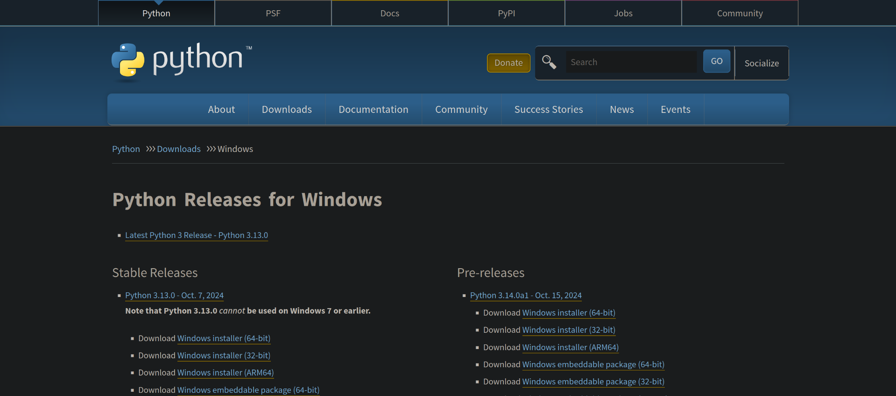
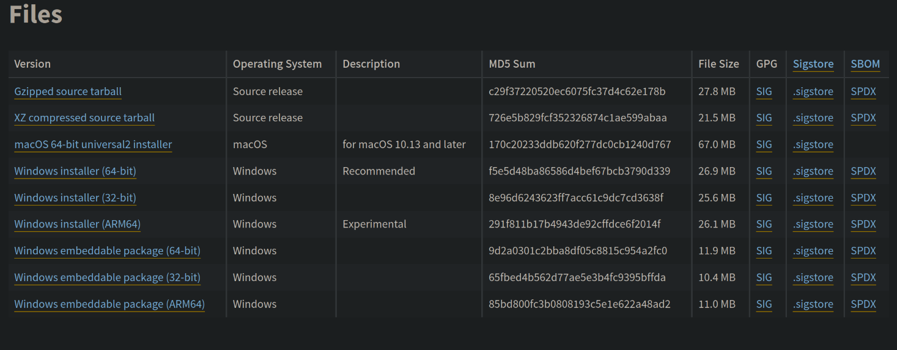

# Fiche Technique : Le floutage

Il est possible de flouter rapidement et simplement des vidéos pour pouvoir les utiliser dans votre communication.

A noter que ce tutoriel ne s'applique que pour des PC et non des téléphones/tablettes.

## 1. Installer python

L'installation de python se fait de façon plutôt simple

### Linux

Normalement, toutes les disbutions Linux existantes ont un intépréteur Python pré-installé.

Il peut toutefois arriver que Python ne soit pré-installé.

#### Debian, Ubuntu et dérivés (APT)

Voici les commandes a taper pour installer python:

```
sudo apt install software-properties-common -y
sudo add-apt-repository ppa:deadsnakes/ppa
sudo apt update
sudo apt install python3.13
curl -sS https://bootstrap.pypa.io/get-pip.py | python3.13
```

Pour d'autres managers de paquets, je vous invite a chercher le tutoriel approprié ^^

### Windows & MacOS

Rendez vous sur le [site de téléchargement de python](https://www.python.org/downloads/windows/)



Choisir la dernière version stable



Selectionner le fichier adapté

Pour une machine windows, on prendra plus facilement l'installer Windows 64 bits. Pour MacOS, on prendra l'installeur MacOS.

Télécharger et lancer l'installation.


## 2. Installer les dépendances

## 3. ?

## 4. Flouter

